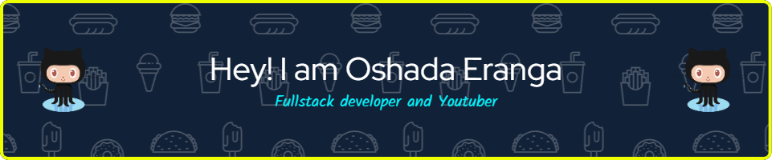

##   About me

<b>Hello, I'm Oshada Eranga from galle. I'm Learning New Technologies for spending time.   As a Youtuber, I'm the owner of <a href="https://www.youtube.com/@ERAMUSICLK/featured">ERA MUSIC LK</a> Youtube Channel.</b>

 
 
 
 
 
 

## 🔗  Languages and Tools
- Languages

  

- Tools

  

 

## Github Activity ✔:

 
 
 
 
 

## Social Media

  

 
 

 
  Visitor count 
  

<h5 align="center">
𝚃𝚑𝚊𝚗𝚔 𝚈𝚘𝚞 𝙵𝚘𝚛 𝚈𝚘𝚞𝚛 𝙲𝚘𝚖𝚒𝚗𝚐 𝙼𝚢 𝙶𝚒𝚝𝙷𝚞𝚋 𝙿𝚛𝚘𝚏𝚒𝚕𝚎 🤝
𝙷𝚊𝚟𝚎 𝚊 𝚠𝚘𝚗𝚍𝚎𝚛𝚏𝚞𝚕 𝚘𝚛 nice 𝚍𝚊𝚢 ! 

</h5>
